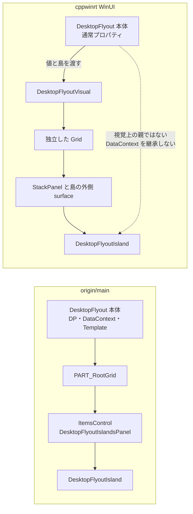

# origin/main と cppwinrt の公開 API 差分・互換回復

比較対象: origin/main `e4dbe1b83705bc88b8c850b2597768e529517caa`、作業開始時の cppwinrt `3fbbd476d09d6e007972cebbb95e5ab4c0a88aa1`。初回監査で見つかった差分と理由は後半の一覧に残し、この作業で戻した API は以下に記録する。

## 今回戻した互換性

| API | 変更 |
|---|---|
| DesktopFlyout の旧17依存プロパティ | WinUI/UWP の両方で `XxxProperty` と `GetValue`/`SetValue` に戻し、Style・Binding・変更通知を有効化 |
| XAML 内容属性 | `DesktopFlyout` の暗黙内容を `Islands`、`DesktopMenuFlyout` の暗黙内容を `Items` に設定 |
| 旧列挙値 | 4列挙型19項目の PascalCase 名と数値を復元 |
| 明示破棄 | `DesktopFlyout`、`DesktopMenuFlyout`、`SystemTrayIcon` に `IClosable` を実装。C# 投影では `IDisposable` として `using` 可能 |
| DataContext | WinUI/UWP のホスト root/panel へ本体の DataContext を転送。表示後の変更も通知経由で伝播し、実行確認は WinUI |
| Point 呼び出し | WinRT ABI は `Windows.Foundation.Point` のまま、WinUI/UWP の C# 投影に `System.Drawing.Point` 拡張を追加 |
| トレイイベントと寿命 | `MouseEventReceivedEventArgs` 名、sender、version 4 の `LOWORD(lParam)`、標準ツールチップ表示を復元。`Destroy()` は再表示用 HWND を保持し、`Close()` が完全解放を行う |
| nint アイコン呼び出し | WinRT ABI の `Int64`/静的ファクトリーを保ちつつ、C# 拡張で `SetIcon(nint)` と factory 呼び出しを追加 |

## 実測した XAML 互換性

一時検証アプリ `artifacts/api-audit/XamlProbe`（gitignore対象）に現行 projection/native DLL をパッケージし、origin/main の実サンプル XAML をそのまま取り込んで実行した。旧アプリの資源辞書も用意し、最新 DLL とパッケージ内 DLL のハッシュ一致を確認した。

| 利用方法 | 結果 |
|---|---|
| C# `DesktopFlyout` 派生クラスを `x:Class` のルートにする | 成功。`InitializeComponent`、`Show`、Island の `XamlRoot` 接続を確認 |
| origin/main の [`ButtonFlyout.xaml`](https://github.com/0x5bfa/DesktopFlyouts/blob/e4dbe1b83705bc88b8c850b2597768e529517caa/samples/DesktopFlyouts.Wasdk.Sample.App/Views/ButtonFlyout.xaml) と [`CustomizableFlyout.xaml`](https://github.com/0x5bfa/DesktopFlyouts/blob/e4dbe1b83705bc88b8c850b2597768e529517caa/samples/DesktopFlyouts.Wasdk.Sample.App/Views/CustomizableFlyout.xaml) | 両方とも生成・表示に成功。後者は3島を生成 |
| origin/main の [`MainDesktopMenuFlyout.xaml`](https://github.com/0x5bfa/DesktopFlyouts/blob/e4dbe1b83705bc88b8c850b2597768e529517caa/samples/DesktopFlyouts.Wasdk.Sample.App/Views/MainDesktopMenuFlyout.xaml) | 4項目を生成し表示に成功。`System.Drawing.Point` 呼び出しも成功 |
| `DesktopFlyout` の暗黙 Islands、`Placement="BottomRight"` | 成功 |
| Style Setter と `FlyoutWidth` Binding | 成功。幅360を設定し、Bindingで480へ反映 |
| x:Bind による通常プロパティ更新 | 成功。幅360から480へ更新 |
| DesktopFlyout の DataContext を使う島内 Binding | 成功。表示後の DataContext 変更も子要素へ反映 |
| C# `using` によるフライアウト解放 | 成功 |

XAML の使い方は origin/main の C# サンプル同様に可能。初回の失敗は古い DLL を含むパッケージで起きており、最新 DLL に入れ替えて再実行した結果を表に記載した。

同じ主要契約を保護するソリューション内の回帰 fixture は [ApiCompatibilityFlyout.xaml](../tests/DesktopFlyouts.WinUI.IntegrationTests/ApiCompatibilityFlyout.xaml) と [統合テスト](../tests/DesktopFlyouts.WinUI.IntegrationTests/UnitTests.cs) に置いた。VSTest 実行で統合テスト2件が成功した。

## 残る差分と境界

`System.Drawing.Point` と `nint` は WinRT ABI にそのまま載せられないため、ABI 上は `Windows.Foundation.Point`、`Int64` と factory を使い、C# 拡張で旧呼び出し形を補っている。これは投影 ABI 上の差で、アプリコードから使う通常の呼び方は維持した。

旧 `ControlTemplate` をフライアウト全体の視覚ツリーとして適用する契約、旧版と同じ島のサイズ配分・再測定・遷移タイミングは今回の修正対象外。現在の WinUI 実装は独立ホスト内に視覚ツリーを構成するため、旧テンプレートキーや全レイアウト動作の完全互換は確認していない。UWP の実機 XAML 表示と通知領域への登録・クリックも未実測。

以下の詳細表は、初回監査で変更前の cppwinrt と origin/main を比較した記録である。「必要」は WinRT ABI に必要、「選択」は実装方式・対象範囲の選択、「根拠なし」は互換性を破る必然性がコード・履歴に見つからなかった変更を指す。今回戻した項目の現状は上の表を優先する。

## 初回監査: DesktopFlyout 全プロパティ

旧定義: [DesktopFlyout.Properties.cs](https://github.com/0x5bfa/DesktopFlyouts/blob/e4dbe1b83705bc88b8c850b2597768e529517caa/src/DesktopFlyouts.Shared/DesktopFlyout.Properties.cs)。現在の契約: [DesktopFlyout.author.h](../src/DesktopFlyouts.WinUI/author/DesktopFlyout.author.h)、UWP の対応: [DesktopFlyout.author.h](../src/DesktopFlyouts.Uwp/author/DesktopFlyout.author.h)。

「DP削除」はプロパティ値の型・基本の既定値は残るが、対応する公開 XxxProperty と GetValue/SetValue・Binding・Style・変更通知の契約がなくなることを表す。以下の17個すべてが該当する。Islands は旧版でも DP ではなく、この数には含めない。

| API | origin/main → 現在 | 変更理由・評価 |
|---|---|---|
| IslandsSource / IslandsSourceProperty | object の DP → IInspectable/投影後 object の通常プロパティ。受け取った IIterable から Islands へコピー | object→IInspectable は必要な ABI 表現。DP削除は根拠なし。null の島をスキップする選択も追加 |
| IsBackdropEnabled / IsBackdropEnabledProperty | bool DP → 通常 bool。既定 true は同じ | ネイティブ背景への直接反映は実装方式の選択。DP削除は不要 |
| IsOpen / IsOpenProperty | private setter を持つ bool DP → 読み取り専用の通常 bool | 読み取り専用は同じ。DPと変更通知の削除は不要。C# に投影しても INotifyPropertyChanged を実装しない |
| FlyoutWidth / FlyoutWidthProperty | GridLength DP → 通常 GridLength。既定 Auto は同じ | 幅の変更を直接ネイティブ配置へ渡す選択。DP削除は不要。Setter と Binding の失敗を実測 |
| FlyoutHeight / FlyoutHeightProperty | GridLength DP → 通常 GridLength。既定 Auto は同じ | 幅と同じ。DP削除は不要 |
| PopupDirection / PopupDirectionProperty | enum DP → 通常 enum。既定 Vertical→vertical | DP削除と改名は不要。自動方向の決め方も変わった。後述 |
| IslandsOrientation / IslandsOrientationProperty | Orientation DP → 通常 Orientation。既定 Vertical は同じ | ネイティブ視覚ツリー再構築の選択。DP削除は不要 |
| Placement / PlacementProperty | enum DP → 通常 enum。既定 BottomRight→bottom_right | DP削除と改名は不要。表示中の変更が配置原点を再評価する保証もない |
| MenuFlyout / MenuFlyoutProperty | MenuFlyout DP → 通常 MenuFlyout | 両版とも本体から自動表示しない参照。DP削除の理由なし |
| IsTransitionAnimationEnabled / IsTransitionAnimationEnabledProperty | bool DP → 通常 bool。既定 true は同じ | WinUI の手組み Storyboard は選択。UWP では値を保存するだけでアニメーションしない |
| PressedScale / PressedScaleProperty | double DP → 通常 double。既定 1.0 は同じ | 現在は setter で有限値を0.1～2.0、非有限値を1.0へ正規化。旧版は実効値の利用時に正規化し、設定値自体を残した。DP削除・保存値の変更は必須ではない |
| IsSwipeToDismissEnabled / IsSwipeToDismissEnabledProperty | bool DP → 通常 bool。既定 false は同じ | WinUI の内部視覚に設定を渡す選択。UWP では保存するだけ。DP削除は不要 |
| SwipeDismissThreshold / SwipeDismissThresholdProperty | double DP → 通常 double。既定80は同じ | 現在は setter で1～2000、非有限値を80に正規化。旧版は利用時に可能な移動距離に合わせた。DP削除・保存値の変更は必須ではない |
| HideOnLostFocus / HideOnLostFocusProperty | bool DP → 通常 bool。既定 true は同じ | ネイティブホストへの直接反映は選択。DP削除は不要 |
| ActivationMode / ActivationModeProperty | enum DP → 通常 enum。既定 Activate→activate | ネイティブホストへの反映は必要な実装。公開DPの削除・列挙値の改名は不要 |
| AutoCloseDelay / AutoCloseDelayProperty | System.TimeSpan DP → Windows.Foundation.TimeSpan。C#ではTimeSpanの通常プロパティ | WinRT型への変換は必要。C#値型は同じ。DP削除は不要。非正の値で無効、開いた後にタイマー開始という基本方針は残る |
| BackdropKind / BackdropKindProperty | enum DP → 通常 enum。DesktopAcrylic→desktop_acrylic | 背景の実装方式は選択。DP削除・改名は不要。非アクティブでも素材を保つ旧制御も置き換わる |

### 残ったコレクションと追加プロパティ

| API | 差分 | 理由・評価 |
|---|---|---|
| Islands | IList<DesktopFlyoutIsland> → IObservableVector<DesktopFlyoutIsland>。C#投影は IList<DesktopFlyoutIsland> | WinRT用コレクションは必要。C# の Add/Clear/Count は残る。内部 VectorChanged→RefreshContent が追加され、変更時に再構築する |
| OwnerWindowHandle | 新規 Int64。C#はlong | HWNDをABIに露出せず親ウィンドウ・モニターを選ぶ設計。追加に合理性あり。値を必須にするWinRT上の理由はなく、未指定時は前面ウィンドウへフォールバック |
| Content | 新規 UIElement の通常プロパティ | 単一要素を手軽に表示する設計上の追加。Islandsより優先。Control継承のままなので暗黙内容にはならない |
| IslandSpacing | 新規 Int32、既定12。setterで0～120に制限 | 旧テンプレート内パネルのSpacing="12"を表側から変えるための追加。合理的な選択だが、固定上限120はABI制約ではない |
| State | 新規読み取り専用 DesktopFlyoutState、closed/open | ネイティブ内部状態を外に出す選択。IsOpenとの情報の重複あり。開閉中の状態を表さず変更通知もない |

## 初回監査: DesktopFlyout メソッド・継承・テンプレート

旧実装: [DesktopFlyout.cs](https://github.com/0x5bfa/DesktopFlyouts/blob/e4dbe1b83705bc88b8c850b2597768e529517caa/src/DesktopFlyouts.Shared/DesktopFlyout.cs)。現在: [DesktopFlyout.cpp](../src/DesktopFlyouts.WinUI/DesktopFlyout.cpp)、[DesktopFlyoutVisual.cpp](../src/DesktopFlyouts.WinUI/DesktopFlyoutVisual.cpp)、[UWP実装](../src/DesktopFlyouts.Uwp/DesktopFlyout.cpp)。

| API・契約 | 差分 | 理由・評価 |
|---|---|---|
| DesktopFlyout() | 存続。旧版はコンストラクターでホストを作成して本体を載せる。現在はShowで遅延生成 | 作成コストと寿命の設計上の選択。破壊的な変更を必須とする理由ではない |
| Control 継承・C#派生 | 存続。現在はunsealed WinRT runtimeclass | XAML派生を可能にするため合理的。実測でx:ClassとInitializeComponentが動作 |
| ContentProperty(Name=Islands) | 削除 | IdlGen authorにも生成IDLにもない。技術的な削除理由なし。暗黙Islandsのコンパイル失敗を実測 |
| Show() | 名前と引数は同じ。現在は有効なOwnerWindowHandleまたは前面ウィンドウを要求 | 独立HWNDホストの設計上の選択。前面ウィンドウ不在で失敗し得る |
| Show(System.Drawing.Point) | Show(Windows.Foundation.Point) | System.Drawing型をWinRT契約にできないためABI変換が必要。C#の旧型受け入れは管理側の互換オーバーロードで維持可能。点は引き続き物理画素の下端中央 |
| ShowAt(int x,int y) | 新規 | Point構築なしで呼ぶ利便性の追加。旧Show削除の理由にはならない |
| Hide() | 存続。WinUIはアニメーション完了後にclosed、UWPは即時閉じる | ネイティブ寿命の同期は必要だが、UWPのアニメーション削除は移植不足。WinUIの公開IsOpenは閉じる遷移完了までtrueを返す基本方針を維持 |
| NavigateFocus(reason=Programmatic) | NavigateFocus() と NavigateFocus(reason) の2オーバーロード | WinRTにC#の省略可能引数をそのまま載せないため合理的。通常の呼出しは維持。引数ありメソッドのMethodInfo上の省略可能引数情報は変わる |
| TryPreTranslateMessage(nint) | UWP限定だったものが双方のInt64/long APIに | ネイティブポインターをWinRTで表すため整数化は合理的。x64/ARM64ではnintを渡せる。WinUIへの追加は共通ホスト機能を公開する選択 |
| Dispose / IDisposable | 削除。IClosable/Closeもない | C++デストラクターによる解放だけ。C#側のusingと明示解放を失う。IClosableと管理側ラッパーで維持する方法があり、削除は必須ではない。Hideは非表示にするだけ |
| OnApplyTemplate のライブラリ独自処理 | 旧PART_RootGrid/PART_IslandsItemsControlとの接続処理を廃止 | 手組みの内部Gridをホストする選択。基底ControlのOnApplyTemplate自体は残るが、設定したTemplateがフライアウト全体として使われる契約は残らない |
| テンプレート資源 | Generic.xaml、DefaultWindows11DesktopFlyoutStyle、DefaultDesktopFlyoutIslandStyle、DefaultWindows11DesktopMenuFlyoutStyleを削除 | 手組み視覚ツリーへの置換。公開資源キーによるカスタマイズが破壊される。C++/WinRTでXAML資源を持てない理由はない |
| DataContext / RequestedTheme / Resources など継承プロパティ | 型には残るが本体がホスト視覚ツリーのルートではなくなる | 本体→内部Grid→島という関係が切れ、継承やTransformToVisual(flyout)の前提を失う。DataContext喪失は実測。Resources等は個別実測していない |
| 本体の BorderBrush / BorderThickness / Template | 公開継承APIは残るがShowの内部Gridには旧TemplateBindingの接続がない | 意図的な内部視覚分離の結果。実際のフライアウト装飾に設定値が届くとは言えない |

元のサンプルの [TrayIconManager.cs](https://github.com/0x5bfa/DesktopFlyouts/blob/e4dbe1b83705bc88b8c850b2597768e529517caa/samples/DesktopFlyouts.Wasdk.Sample.App/TrayIconManager.cs) はフライアウト切替時に oldFlyout.Dispose() を呼ぶ。現在はこのコードをそのままコンパイルできず、Hideへの置換では解放の意味を保存できない。

### 同じ名前でも変わった動作

| 設定・操作 | 旧版 → 現在 | 理由・評価 |
|---|---|---|
| PopupDirection=Horizontal/Vertical | 最終配置の画面内位置から自動判定 → Coreのplacement分類を主に使って判定 | Coreへ純粋な計算を分離した選択。しかし最終boundsからも純粋計算できるので意味変更は必須でない。bottom_right+horizontalが旧right_to_leftからleft_to_rightへ変わる |
| Show(point) のタスクバー端 | 旧版は左右/上/下タスクバーを判定して端に合わせる → Coreは下端中央アンカーを一般的に計算 | 移植でタスクバー判定が欠落。C++移行に必須でない |
| モニター選択 | 引数なしは主画面/システム作業領域中心 → 親/前面ウィンドウのモニター | OwnerWindowHandle追加と対応した設計変更。意図と互換性を明記すべき |
| Margin | 旧四辺の余白を保持 → Coreへ渡す外側距離は各辺の最大値 | Core.layout_request.marginが単一整数という設計の結果。UWPは特に四辺差を保存しない。非対称余白の同等性はない |
| Width/Height の Auto・Star、HorizontalAlignment/VerticalAlignment | 旧版は本体の配置/テンプレートによる伸張も考慮 → 通常プロパティを基に内部視覚を測定 | 手組み視覚への変更。サイズAPIの型が同じでもレイアウト同等性は保証されない |
| IslandWidth/IslandHeight の Pixel/Star | 旧版はDesktopFlyoutIslandsPanelで分配 → WinUIの本体はStackPanelを使う | 公開パネルの星分配がShow経路で使われない。UWP本体はパネルを使用。不要な機能退行 |
| 島をCollapsedにする | 旧版はownerへ通知して再配置 → 現在はownerへのVisibility/個別サイズ通知がない | 特にWinUIでは外側surfaceが残り、Spacing/枠の意味も旧版と異なる。実行上の全組合せは未検証 |
| PressedScale/IsSwipeToDismissEnabled/SwipeDismissThresholdの表示中の変更 | 旧版は値を操作時に参照 → WinUIはRefreshContent/UpdateFlyoutLayout時に内部視覚へコピー | setter直後の反映が保証されない。外側変更通知の欠落とは別の問題 |
| UWPのアニメーション・押下拡縮・スワイプ | 旧共有実装あり → プロパティ値保存のみ | ShowCore/Hideは即時で、各値を効果へ反映する経路なし。C++/UWPの制約を示す根拠なし |
| WinUI背景の非アクティブ状態 | 旧DesktopFlyoutSystemBackdropはIsInputActive=true → 標準MicaBackdrop/DesktopAcrylicBackdropに置換 | 背景を内部で生成する設計は維持したが、旧素材制御の意味は同じでない。背景の見た目全体は未実測 |

## 初回監査: DesktopMenuFlyout 全メンバー

旧定義: [DesktopMenuFlyout.cs](https://github.com/0x5bfa/DesktopFlyouts/blob/e4dbe1b83705bc88b8c850b2597768e529517caa/src/DesktopFlyouts.Shared/DesktopMenuFlyout.cs)。現在: [author](../src/DesktopFlyouts.WinUI/author/DesktopMenuFlyout.author.h)、[WinUI実装](../src/DesktopFlyouts.WinUI/DesktopMenuFlyout.cpp)、[UWP実装](../src/DesktopFlyouts.Uwp/DesktopMenuFlyout.cpp)。

| API | 旧版 → 現在 | 変更理由・評価 |
|---|---|---|
| ItemsControl 継承、Items | 維持。メニュー項目を直接XAML子要素にできる | C#派生と旧メニューXAMLのコンパイルを確認 |
| DesktopMenuFlyout() | 存続。ホストの生成はShowへ遅延 | 設計上の選択 |
| IsOpen / IsOpenProperty | getter・bool DP・既定falseを維持。静的readonlyフィールドから静的getterに | DPをネイティブでも維持できる証拠。反射のGetFieldは非互換 |
| Show(System.Drawing.Point) | Show(Windows.Foundation.Point) | WinRT表現への変更は必要。C#互換オーバーロードは追加可能。整数へ丸める |
| Hide() | 存続 | 基本機能は維持 |
| TryPreTranslateMessage(nint) | UWP限定→両版でInt64/long | ポインターのABI表現変更は合理的。WinUIへの追加は選択 |
| Dispose / IDisposable | 削除。公開Closeもない | 必須の理由なし。C++デストラクターのみではC#のusingを維持しない |
| OwnerWindowHandle | 新規Int64、既定0、通常プロパティ | 親ウィンドウを明示する設計上の追加 |
| MenuFlyout | 新規MenuFlyout、既定null、通常プロパティ | ネイティブの実メニューを指定する追加。ただしRebuildMenuFlyoutItemsが渡したメニューのItemsを消して、本体Itemsから補充する |
| ShowAt(int,int) | 新規 | 座標の直接指定という利便性の追加 |
| OnApplyTemplate / OnItemsChanged の独自override | 削除 | 表示先を内部Grid/Borderに変えた選択。基底ItemsControlのAPI自体を削除したわけではない |

表示中のItems変更は旧OnItemsChangedで同期していたが、現在はMenuFlyout設定時とShow時の再構築になった。不正な項目は旧明示castの失敗からtry_asでの無視へ変更された。旧表示時・システム設定変更時のテーマ更新と既定テンプレートへの接続もなくなった。これらの意味変更がC++/WinRT移行に不可欠という根拠はない。

旧 [MainDesktopMenuFlyout.xaml](https://github.com/0x5bfa/DesktopFlyouts/blob/e4dbe1b83705bc88b8c850b2597768e529517caa/samples/DesktopFlyouts.Wasdk.Sample.App/Views/MainDesktopMenuFlyout.xaml) は本調査でコンパイルできた。ただしShow、項目更新、全テンプレート比較まで実行したという意味ではない。

## 初回監査: 島・テンプレート設定・公開パネル

契約は [WinUI author](../src/DesktopFlyouts.WinUI/author/DesktopFlyout.author.h) の先頭部分、実装は [DesktopFlyout.cpp](../src/DesktopFlyouts.WinUI/DesktopFlyout.cpp) にある。UWPも対応するプラットフォーム基底型を使う。

| 型とAPI | 旧版 → 現在 | 変更理由・評価 |
|---|---|---|
| DesktopFlyoutIsland: ContentControl継承、コンストラクター | 維持。現在はunsealed runtimeclass | XAML派生と島のContentを保つ合理的な構成 |
| TemplateSettings | 読み取り専用の通常プロパティ、島ごとの設定オブジェクトを維持 | ABI用クラスへの変更。DPではなかった |
| IslandWidth / IslandWidthProperty | GridLength DP、Autoを維持 | 型・基本契約は維持。ただし変更時に所有者へ再測定を通知する旧callbackがない |
| IslandHeight / IslandHeightProperty | GridLength DP、Autoを維持 | 幅と同じ。WinUIのShow経路では公開パネルを使用しないためPixel/Starの意味が失われる |
| OnApplyTemplate の独自処理 | 削除。角丸監視をコンストラクターへ移動 | 監視寿命の変更は選択。Visibility/LayoutUpdated/所有者通知の削除理由はない |
| DesktopFlyoutIslandTemplateSettings: DependencyObject継承、コンストラクター | 維持。暗黙コンストラクターを明示宣言 | WinRT activation用の表現 |
| BackdropCornerRadius / BackdropCornerRadiusProperty | WinUIではDPを維持。internal setter→公開setter | 公開範囲の拡大は設計選択。WinRTで非公開の実装用setterを持つこと自体は可能 |
| SystemBackdrop / SystemBackdropProperty | WinUIではDPを維持。internal setter→公開setter | 公開範囲の拡大は選択。ただし本体から自動設定する旧経路はなく、外側SystemBackdropElementへ直接設定される |
| UWP TemplateSettings | 旧版は空。現在はBackdropCornerRadiusとDPを追加 | UWPにはSystemBackdrop型がないため双方ともこのプロパティはない。角丸の追加は選択 |
| DesktopFlyoutIslandsPanel: Panel継承、コンストラクター | 維持 | Children等の基底APIも残る |
| Orientation / OrientationProperty | Orientation DP、既定Verticalを維持 | setterはInvalidateMeasureするが、DP metadataの変更callbackが消えた。Binding/直接SetValue経路の再測定通知を失う必要性なし |
| Spacing / SpacingProperty | double DP、既定0を維持 | Orientationと同じ。DesktopFlyout.IslandSpacingの既定12とは別 |
| MeasureOverride / ArrangeOverride | 独自実装を維持。公開IDLの追加メソッドではなく基底Panelのoverride | 星サイズを配分する設計は残るがWinUI本体では未使用。合計星重み0のMeasureに無限大を渡し、Arrangeは0にする差分もある |

旧DPの静的readonlyフィールドは現在の静的getterへ変わる。通常の型名.XxxPropertyというC#参照は使えるが、フィールド反射には互換でない。

島のBackground/CornerRadius/BorderThickness/Templateは継承で残る。しかし現在のWinUIの外側surfaceは独自の背景・枠・角丸を生成するため、旧TemplateBindingと同じ装飾の制御にはならない。TemplateSettings.SystemBackdropを使う旧カスタムテンプレートも、現在は所有者からその値を供給されない。

## 初回監査: SystemTrayIcon とイベント引数

旧定義: [SystemTrayIcon.cs](https://github.com/0x5bfa/DesktopFlyouts/blob/e4dbe1b83705bc88b8c850b2597768e529517caa/src/DesktopFlyouts.Shared/SystemTrayIcon.cs)。現在: [author](../src/DesktopFlyouts.WinUI/author/SystemTrayIcon.author.h)、[WinUI実装](../src/DesktopFlyouts.WinUI/SystemTrayIcon.cpp)、[UWP実装](../src/DesktopFlyouts.Uwp/SystemTrayIcon.cpp)、[C#拡張](../src/DesktopFlyouts.WinUI.Projection/SystemTrayIconExtensions.cs)。

| API | 旧版 → 現在 | 変更理由・評価 |
|---|---|---|
| SystemTrayIcon の継承 | public class、IDisposable → sealed WinRT runtimeclass、IDisposableなし | 他言語へのWinRT公開は合理的。sealed化・明示破棄の削除まで必須とする説明なし |
| SystemTrayIcon(string iconPath,string tooltip,Guid id) | 維持 | string/GuidはWinRT投影できる。引数数・C#呼出し形式は同じ |
| SystemTrayIcon(nint hIcon,string tooltip,Guid id) | 削除。CreateFromIconHandle(long,string,Guid)へ | ポインターはWinRT ABIに載らず、さらにWinRTコンストラクターは同じ引数数でオーバーロードできない。静的ファクトリーは必要。C#側で旧 `new` 構文を提供する別の管理ラッパーはない |
| SystemTrayIcon() | 新規 | XAML等から既定作成できるための選択。既定パスは空、ツールチップはDesktopFlyouts、Guidは空。空パスでは標準アプリケーションアイコンを使う |
| CreateFromIconHandle | 新規静的ファクトリー | ハンドルはCopyIconして保持する。呼出し元所有のハンドルを破棄可能という基本の所有権は旧版と同じ |
| IconPath | string?、private setter→WinRT Stringのgetter | 文字列のABI表現が必要。ハンドル指定時は旧nullから現在空文字へ変化。変更後のnull判定に影響 |
| Tooltip | string getter/setterを維持 | 現在は表示中にShowで更新。version4のNIF_SHOWTIPがなくなったため設定文字列が標準ツールチップに表示される契約は後退 |
| IsVisible | bool getter/setterを維持、初期false | 旧版は未登録時に値を保存。現在はtrueでShowを即時実行し、falseで登録削除。登録/非表示の意味が変わる。型変更の必須理由なし |
| Id | Guid getterを維持 | Windows版は同じ。Linux旧版のIdはstringであり別契約 |
| LeftClicked | EventHandler<MouseEventReceivedEventArgs> → EventHandler<SystemTrayIconEventArgs> | WinRTイベント型は必要。引数クラス名の改名は不要。送信元はthisからnullへ変化 |
| RightClicked | 同上 | 同上 |
| LeftDoubleClicked | 同上 | 同上 |
| RightDoubleClicked | 同上 | 同上 |
| Show() | 存続 | Shell登録/更新を行う。現在はNIM_MODIFY失敗時に再登録する旧回復処理がない |
| SetIcon(string) | 存続 | 旧ファイル存在検査の例外からWin32失敗のHRESULT例外へ変更。画像読み込みサイズも標準の小アイコン寸法へ変化。移行必須でない |
| SetIcon(nint) | WinRTインスタンスAPIとして削除、SetIconHandle(long)へ | 通常メソッドの同じ引数数のoverloadにはdefault_overloadを指定する選択肢もあるので改名は必須ではない。C#ではSetIcon(nint)拡張により通常呼出し形式を維持 |
| SetIconHandle(long) | 新規 | ABI上のハンドル表現と型区別のための追加。ハンドルをコピーする基本の意味は維持 |
| SystemTrayIconExtensions.CreateFromIconHandle(nint,string,Guid) | 新規の静的補助 | 拡張コンストラクターではなく、旧new SystemTrayIcon(nint,...)をそのまま維持しない |
| Destroy() | 存続するが意味変更 | 旧版はShell登録だけ削除しShowで再利用可能。現在はコールバックHWNDも破棄し、ShowはHWNDを再生成しない。必須理由なし |
| Hide() | 新規 | Shell登録を削除しHWNDを残す。旧Destroyの用途に近い。ただし旧Destroyの名前を変えず意味だけ変える必要性なし |
| Dispose() / IDisposable | 削除 | 明示的な解放・usingの契約を喪失。IClosableを実装する代替がある |
| protected virtual Dispose(bool) | 削除 | 旧C#派生クラスの破棄拡張契約も喪失。sealed化と合わせた設計選択で、必須とする根拠なし |
| MouseEventReceivedEventArgs | 型を削除しSystemTrayIconEventArgsへ | System.EventArgs継承をWinRTで公開しない点は合理的。名前まで変える必然性なし |
| MouseEventReceivedEventArgs.Point | System.Drawing.Point → Windows.Foundation.Point | ABI型変更が必要。物理画素の中心座標は基本的に維持。現在は取得失敗時にカーソル位置へフォールバックし、半画素の値も返し得る |
| SystemTrayIconEventArgs(Point) | 新規公開コンストラクター | 旧型のコンストラクターはinternal。外部から合成できるようにする追加は設計選択 |

WinRTコンストラクターは同じ引数数でオーバーロードできず、`default_overload` もコンストラクターには使えない。[Microsoft MIDL仕様](https://learn.microsoft.com/en-us/uwp/midl-3/predefined-attributes#the-default_overload-attribute)。そのためアイコンハンドル版は静的ファクトリーにし、C#拡張で `nint` を受ける呼び出しを補った。通常メソッドには別のオーバーロード規則があるため、コンストラクターと同じ制約を当てはめない。[IClosableは.NETでIDisposableへ投影される](https://learn.microsoft.com/en-us/uwp/api/windows.foundation.iclosable?view=winrt-26100)ため、C++デストラクターへ移したことをDispose契約削除の必須理由にはできない。

### 同じトレイAPIの動作退行

以下はWinUI/UWPの双方で実装を照合した静的な指摘であり、実際の通知領域を操作した結果ではない。

| 差分 | 根拠 | 理由・評価 |
|---|---|---|
| version4通知の識別 | 旧LOWORD(lParam) → 現在switch(static_cast<UINT>(lParam))。ShowはuID=1、NOTIFYICON_VERSION_4を指定 | 上位ワードのIDを含む通知をメッセージ定数と比較してしまう。クリックイベントが届かなくなる経路がある。不要な退行 |
| 標準ツールチップ | 旧NIF_SHOWTIPあり → 現在なし | version4では標準ツールチップを抑止する仕様。Tooltipの意味を保存していない。不要な退行 |
| sender | 旧this → 全4イベントでnullptr | イベントの送信元を取り出せなくなる。WinRT制約でない |
| Destroy後のShow | HWNDを破棄したまま登録処理を行う | 旧再利用契約を保存しない。不要な退行 |
| 非表示 | 旧NIF_STATE/NIS_HIDDEN → 現在NIM_DELETE | Shellからの一時非表示と登録削除を変える設計選択 |
| アイコン画像の読込失敗 | 旧画像読込後にHWND作成 → 現在HWND作成後に画像読込 | コンストラクターの例外時にHWNDを破棄する所有処理がなく、リーク/無効なユーザーデータを残す懸念。公開API変更の必然性なし |
| NIM_MODIFY失敗時の回復 | 旧は再作成 → 現在戻り値を無視 | タスクバー再起動通知による回復は残るが、更新失敗全般の回復は削除。必須理由なし |

通知のLOWORD/HIWORDとNIF_SHOWTIPは [MicrosoftのNOTIFYICONDATAW仕様](https://learn.microsoft.com/en-us/windows/win32/api/shellapi/ns-shellapi-notifyicondataw) で照合した。現在の通常通知経路は [WinUI SystemTrayIcon.cpp:84](D:/source/DesktopFlyouts/src/DesktopFlyouts.WinUI/SystemTrayIcon.cpp:84)、[UWP SystemTrayIcon.cpp:83](D:/source/DesktopFlyouts/src/DesktopFlyouts.Uwp/SystemTrayIcon.cpp:83)。既存のネイティブトレイテストはRaise*を直接呼び、この通知の分割処理を検証していない。

## 初回監査: 列挙値の差分

数値はすべて維持されている。名前の変更を要求するWinRT制約はない。内部Coreの小文字名に合わせたとしても、公開名は別に保持できるため「根拠なし」と評価する。

| 型 | 旧名 → 現在名 | 数値 |
|---|---|---|
| DesktopFlyoutPlacementMode | TopCenter → top_center | 0 |
| 同上 | TopLeft → top_left | 1 |
| 同上 | TopRight → top_right | 2 |
| 同上 | BottomCenter → bottom_center | 3 |
| 同上 | BottomLeft → bottom_left | 4 |
| 同上 | BottomRight → bottom_right | 5 |
| 同上 | LeftCenter → left_center | 6 |
| 同上 | RightCenter → right_center | 7 |
| DesktopFlyoutPopupDirection | BottomToTop → bottom_to_top | 0 |
| 同上 | TopToBottom → top_to_bottom | 1 |
| 同上 | Vertical → vertical | 2 |
| 同上 | LeftToRight → left_to_right | 3 |
| 同上 | RightToLeft → right_to_left | 4 |
| 同上 | Horizontal → horizontal | 5 |
| DesktopFlyoutActivationMode | Activate → activate | 0 |
| 同上 | NoActivateOnOpen → no_activate_on_open | 1 |
| 同上 | NeverActivate → never_activate | 2 |
| DesktopFlyoutBackdropKind | DesktopAcrylic → desktop_acrylic | 0 |
| 同上 | Mica → mica | 1 |
| DesktopFlyoutState（新規） | 対応なし → closed / open | 0 / 1 |

旧4型の計19個の名前がC#にもそのまま変更される。数値で保存した設定は読めても、ソースコード・XAML文字列・enum名の文字列保存には互換性がない。

## ホスト・Uno/Linux・配布対象

旧srcの独自公開型は、プラットフォーム限定を含めて15型。XAML5型、トレイと旧イベント引数、列挙型4型、UWPアプリケーション1型、Unoの追加3型を全て上の表と以下で対応づけた。WinUI/UWPの現在のWinRT契約は各7クラス・5列挙型、これとは別にC#のSystemTrayIconExtensionsがある。生成されたABI補助型や内部CoreのC++計算型はC#利用者向けの旧APIの代替として数えていない。

| 旧公開API・対象 | 現在 | 理由・評価 |
|---|---|---|
| DesktopFlyouts.Shared.XamlIslandApplication、公開コンストラクター、Application基底 | 削除 | UWPホストをネイティブへ移した選択。公開型を残せない必須理由なし |
| TransparentWindow、公開コンストラクター、Window基底 | 削除 | Uno/Linux対象を外した選択。Windows専用DLLをLinuxで使えないことは、別実装の削除まで必須にはしない |
| MouseScrollOrientation.Vertical / Horizontal | 削除 | Uno/Linuxトレイのスクロール対象を外した選択 |
| MouseScrollEventReceivedEventArgs.Delta / Orientation | 削除 | 同上。旧コンストラクターはinternal |
| Linux SystemTrayIcon(string,string,Guid) | Linux版を削除 | Windowsの同引数コンストラクターが残ることはLinux互換を意味しない |
| Linux SystemTrayIcon(string,string,string) | 削除 | 文字列IDのStatusNotifierItem契約を削除。WindowsのGuidファクトリーは代替にならない |
| Linux SystemTrayIcon.Id:string | 削除 | 同上 |
| Linux IconPath、Tooltip、IsVisible、Show、SetIcon(string)、Destroy、Dispose | Linux版を削除 | 共通名がWindowsに残ってもD-Bus/StatusNotifierWatcher/X11の動作はない |
| Linux LeftClicked / RightClicked | Linux版を削除 | Windowsのイベントはプラットフォーム代替ではない |
| Linux MiddleClicked / Scrolled | 削除 | 対応する現在の公開イベントなし |
| DesktopFlyouts.Uno パッケージ、net9.0-desktop/net10.0-desktop | 削除 | 初期移行文書でWindows対象に限定すると説明された設計選択 |
| DesktopFlyouts.WinUI / DesktopFlyouts.Uwp パッケージID | 維持 | READMEに残る旧別名とは区別。csprojのPackageIdを照合 |
| .NET対象 | net9+net10 → net10のみ | 互換性縮小。WinRT自体がnet10しか使えないという理由はない |
| ネイティブ対応アーキテクチャ | 旧C#サンプルはx86配布設定あり → 現在x64/ARM64のみ | x86対応の削除理由は履歴にない |
| 配布構成 | 管理実装 → C# projection + プラットフォーム別native DLL | C++/WinRTの実装に対応する合理的な変更。DLLの活性化登録も必要になる |
| 消費側の活性化登録 | 統合テストはmanifestに7型を手動登録 | projectionの参照だけで実行準備が完結すると証明されていない。今回も専用manifest登録を使用した。外部NuGetだけでの利用は未実測 |
| native入力の生成順序 | projection単独projectにnative ProjectReferenceなし、CsWinRTInputsは既存winmdパス | ソリューションの順序と既存生成物に依存し得る。単独の新規消費側restore/buildの保証とは別 |

初期方針の根拠は [e485dc5当時の移行文書](https://github.com/0x5bfa/DesktopFlyouts/blob/e485dc5/docs/cppwinrt-migration.md)。UWPは後から再追加されたがUnoは戻っていない。内部型だったXamlIslandHostWindow、GeneralHelpers、WindowHelpers、ManualDefinitions、IXamlSourceTransparency、X11PInvokeのpublic入れ子型などは、旧公開APIからの削除として誤計上していない。

内部ホストにも、旧CBTフック/子孫のフォーカス抑制、UWP透明背景指定、CoreWindowへのサイズ・テーマ転送、テーマ変更通知に相当する経路の縮小/欠落がある。公開APIの署名差分とは区別するが、NeverActivate等の動作を旧版と同じと保証する根拠にはならない。

## 残る調査・互換性項目

1. 旧 `ControlTemplate` を含む `DesktopFlyout` 全体のテンプレート差し替えと、旧島パネルのサイズ配分・再測定を比較する。
2. UWP 側で旧 C# XAML サンプルを実行し、Show/Hide、テーマ、島サイズ、操作プロパティを検証する。
3. 実際の通知領域で version 4 のクリック、タスクバー再起動後の再登録、NIM_MODIFY 失敗回復を検証する。
4. 外部アプリへのパッケージ活性化登録と native DLL 配布を、ソリューション外から確認する。

## 根拠と検証範囲

主な変更は e485dc5「Init」で旧実装を置換し、d38eeb3「Finish up the rest of API & add projections」で島・メニュー・projection等を追加した。履歴の件名・本文には各DP削除や列挙値改名が不可避だったという説明はない。非agile指定には「HWND/XAMLを作成UIスレッドで扱う」というauthorコメントがあり、この部分には技術的理由がある。

指定された Visual Studio MSBuild でソリューション全体をビルドし、WinUI/UWP のネイティブ・C# projection・テスト・サンプルが成功した。加えて、専用パッケージの WinUI 実行検証で origin/main の3つの C# XAML クラスを生成・表示した。通知領域への登録と UWP の XAML 実行は未検証であり、上記の残件としている。
